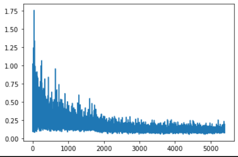
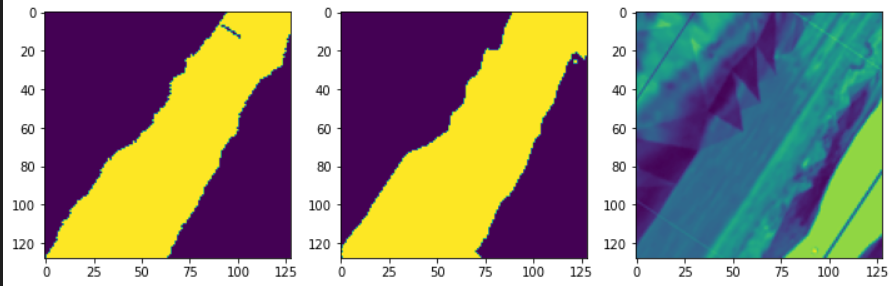
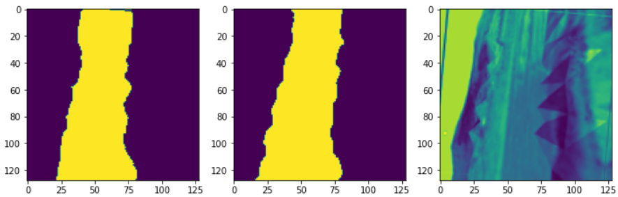
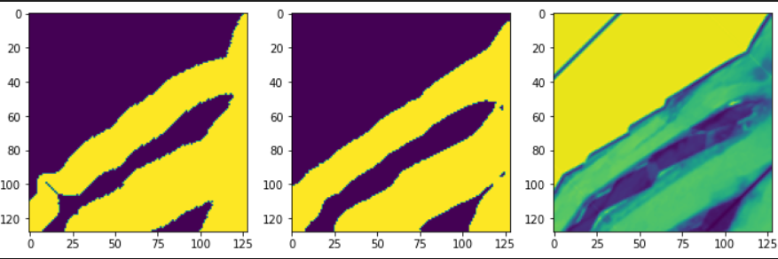
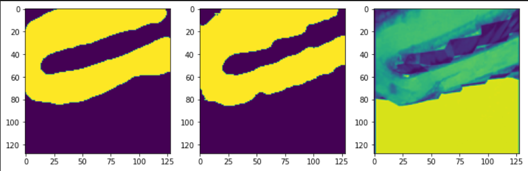
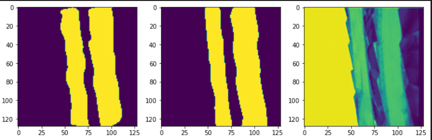

# Real-Time-Road-Segmentation-from-UAV-Data
    - The goal is to segment out roads on a gazebo world using video captured by a drone for UGV to drive autonomously.  
    - I gathered the data by taking the video footage form the drone and the annotating it using the CVAT online tool. 
    - I used the UNET model with MobileNetV2 encoder with parallel processing using multiple GPUs in Pytorch to train the model.
    - The model achieved an accuracy of 99% on training data with an inference time of 120ms.

  

The above image shows the BCEWithlogitsLoss plot of the training.

### Here are some of the results after training:
    - The leftmost image is the actual label
    - The middle image is the prediction
    - The righmost is one channel of the given road image taken by the drone

  

  

  

  

  

